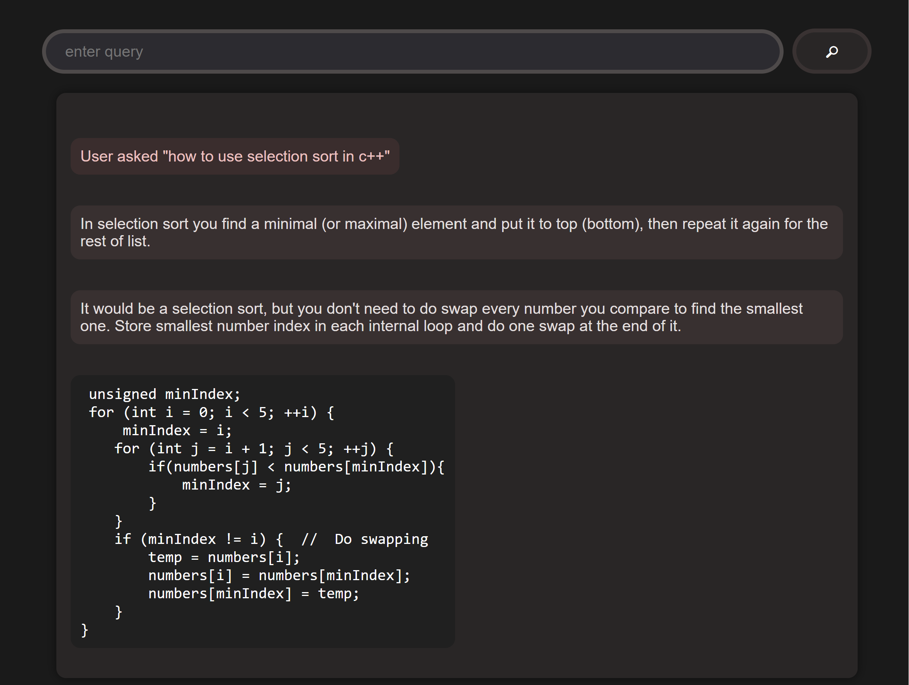
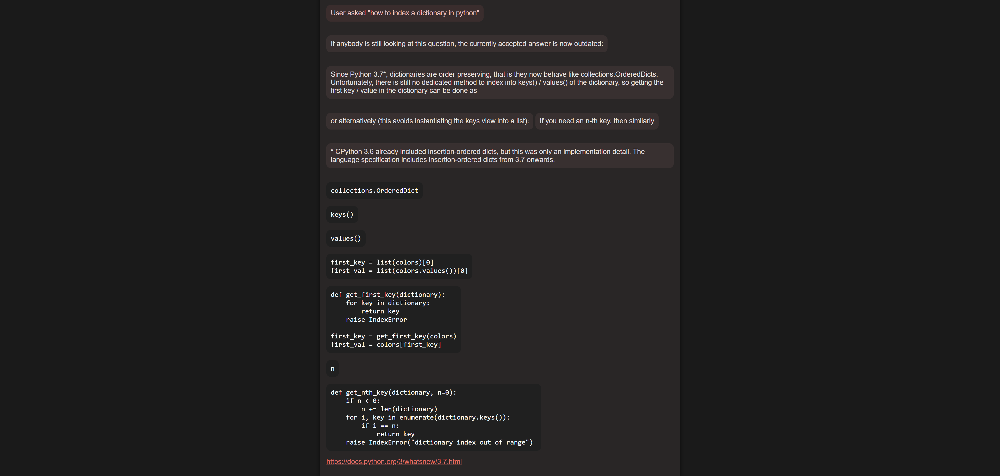
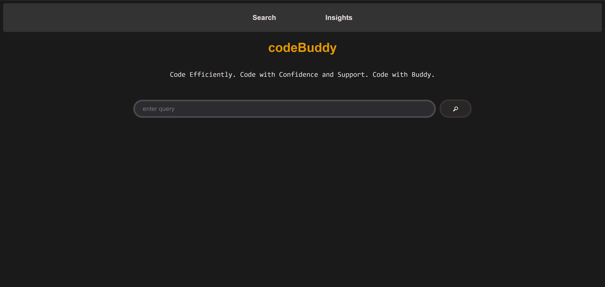

# codeBuddy

Data extraction application to aid humans in software development.

## Features

Response to user query can provide paragraph explanation, code snippets, and resource links.

Resources:

* [Stack Exchange API](https://api.stackexchange.com/)
* [Stack Overflow](https://stackoverflow.com/)

Ambiguity and typos are filtered during response generation.

## Installation

Clone the repository:

```
https://github.com/danmxli/codeBuddy.git
```

Create a virtual environment (recommended) and install python modules from requirements.txt:

```
pip install -r requirements.txt
```

Navigate to the `api` directory, then run `flask run` to start the server.

## User Interface








